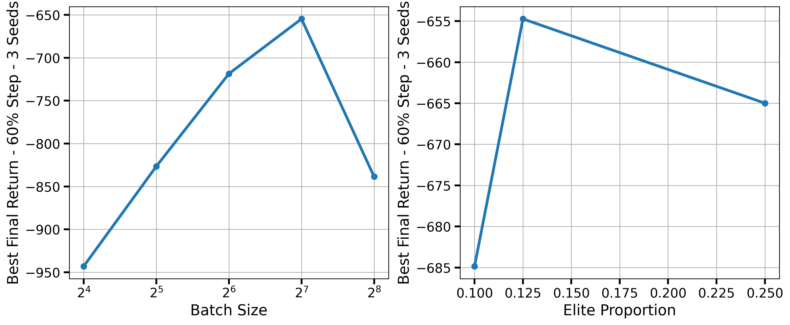
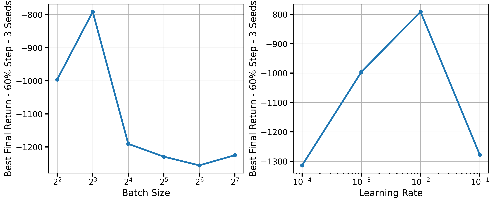

# Perspectives on Empirical Reinforcement Learning Agents Comparisons.

## Why do researchers design Reinforcement Learning agents?
Intro on policy optim and related work on empirical RL.
## What are typical methodologies for comparing agents?
### I. Setting (mis)specification.
### II. Fully specifying an agent.
#### 1. Sweeping agent hyperparameters [BO, random, expanding bounds].
#### 2. Choosing the *best* agent hyperparameters. 
#### 3. Train the fully-specified agent with more budget.
### III. Experimenting and analysing with the fully specified-agent

