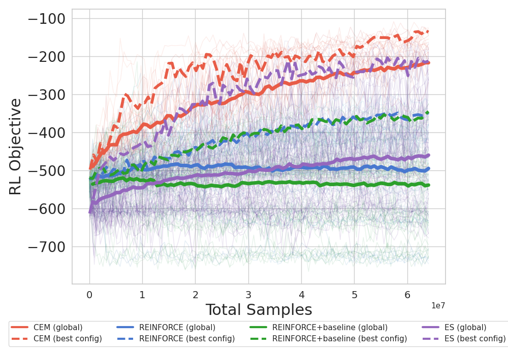

# Reinforcement Learning Optimization Methods Comparison

## Introduction

Reinforcement Learning (RL) aims to maximize the expected sum of discounted rewards, known as the RL objective:

$$J(\theta) = \mathbb{E}_{\tau \sim p_\theta(\tau)}\left[\sum_{t=0}^{T} \gamma^t r_t\right]$$

where $\theta$ represents the policy parameters, $\tau$ is a trajectory, $p_\theta(\tau)$ is the probability of that trajectory under policy $\theta$, $r_t$ is the reward at time $t$, and $\gamma$ is the discount factor.

This repository compares different optimization methods for this objective, specifically the Cross-Entropy Method (CEM) and REINFORCE, on continuous control tasks. We investigate how these methods perform with various hyperparameter settings and analyze their sample efficiency and computational requirements.

## Optimization Methods

Both algorithms can be viewed as methods that collect rollouts and then optimize policy weights based on these rollouts, but they differ in how they use this information.

### REINFORCE

REINFORCE (Williams, 1992) is a policy gradient method that directly optimizes the policy parameters by estimating the gradient of the expected return. For each update:

```python
# Single update of REINFORCE
def reinforce_update(policy, env, batch_size, learning_rate):
    all_states, all_actions, all_returns = [], [], []
    
    # Collect batch_size trajectories
    for _ in range(batch_size):
        states, actions, rewards, returns = rollout_trajectory(env, policy)
        
        all_states.extend(states)
        all_actions.extend(actions)
        all_returns.extend(returns)
    
    # Compute policy gradient and update weights
    gradients = compute_policy_gradient(policy, all_states, all_actions, all_returns)
    policy.weights = policy.weights + learning_rate * gradients
```

A common variant is REINFORCE with baseline, which reduces variance by subtracting a baseline (typically the average return) from the returns.

### Cross-Entropy Method (CEM)

CEM (Rubinstein, 1999) is a derivative-free optimization method that maintains a distribution over policy parameters. For each update:

```python
# Single update of CEM
def cem_update(policy_population, env, n_evals, elite_fraction):
    # Evaluate each member of the population
    scores = []
    for policy in policy_population:
        # Evaluate each member n_evals times
        all_returns = []
        for _ in range(n_evals):
            states, actions, rewards, returns = rollout_trajectory(env, policy)
            all_returns.append(returns[0]) # first element is the sum of discounted rewards
        # Average score across evaluations
        scores.append(mean(all_returns))
    
    # Select elite performers
    n_elite = int(population_size * elite_fraction)
    elite_indices = argsort(scores)[-n_elite:]
    elite_population = population[elite_indices]
    
    # Update parameter distribution
    new_mean = mean(elite_population, axis=0)
    new_std = std(elite_population, axis=0)
    policy_population = random.multivariate_gaussian(mean=new_mean, cov=diag(new_std), size=len(policy_population))
```

## Experimental Setting

### Policy Representation

We use a Beta distribution policy for continuous control, which has been shown to be effective for bounded action spaces (Chou et al., 2017). The Beta distribution naturally constrains actions to a bounded range [0,1], which can then be scaled to the environment's action range.

Our policy network consists of:
- Two 16 neurons hidden layers with ReLU activations
- An output layer that parameterizes alpha and beta parameters of the Beta distribution

### Environment

We use the Pendulum-v1 environment from Gymnasium, a classic continuous control problem where the agent must learn to swing up and balance an inverted pendulum.

### Hyperparameter Search

We conducted a grid search over the following hyperparameters for each algorithm:

**CEM Hyperparameters:**

| Parameter | Values |
|-----------|--------|
| Number of evaluations per policy in population | 1, 2, 50 |
| Elite proportion | 0.125, 0.25 |
| Population size | 64 (fixed) |

**REINFORCE Hyperparameters:**

| Parameter | Values |
|-----------|--------|
| Learning rate | 0.0001, 0.001, 0.01, 0.1 |
| Batch size | 8, 16, 32, 64, 128, 400, 800, 1600, 3200 |

**REINFORCE with Baseline Hyperparameters:**

| Parameter | Values |
|-----------|--------|
| Learning rate | 0.0001, 0.001, 0.01, 0.1 |
| Batch size | 8, 16, 32, 64, 128, 400, 800, 1600, 3200 |

Each algorithm with each hyperparameter combination was trained on 3 different random seeds on identical CPU hardware to ensure fair comparison.

### Implementation Details

For both algorithms, we implemented full parallelization to maximize computational efficiency:
- For CEM, we parallelize the evaluation of each population member
- For REINFORCE, we parallelize the collection of episodes within each batch

This parallelization ensures that both methods can utilize available computational resources efficiently, making the comparison more focused on algorithmic differences rather than implementation details.

## Results

After conducting the hyperparameter sweep, we plotted the performance of all configurations in terms of sample efficiency. The results can be seen in the figure below:



The plot shows the RL objective (expected return) as a function of the total number of environment samples used during training.

## References

- Williams, R. J. (1992). Simple statistical gradient-following algorithms for connectionist reinforcement learning. Machine Learning, 8(3-4), 229-256.
- Rubinstein, R. (1999). The cross-entropy method for combinatorial and continuous optimization. Methodology and Computing in Applied Probability, 1(2), 127-190.
- Chou, P. W., Maturana, D., & Scherer, S. (2017). Improving stochastic policy gradients in continuous control with deep reinforcement learning using the beta distribution. In International Conference on Machine Learning (pp. 834-843).
- Tang, Y., & Agrawal, S. (2018). Boosting trust region policy optimization by normalizing flows policy. arXiv preprint arXiv:1809.01672.
